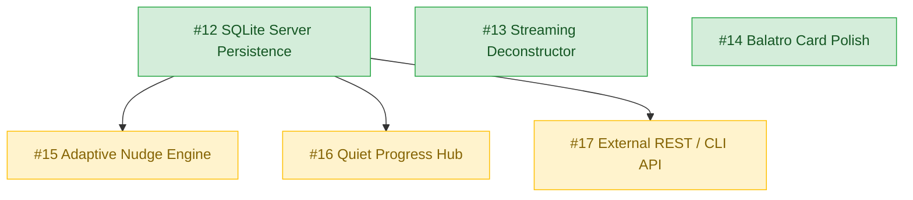

# Nudge Engineering Roadmap & Multi-Agent Tracker 🗺️

This roadmap tracks the development milestones for Nudge. Each item corresponds to an active, well-specified GitHub issue tagged `ready-for-agent` with full user stories, explicit acceptance criteria, testing seams, and dependency edges.

---

## Dependency Graph

---

## Active Issues

### 🟢 Unblocked (Ready for Immediate Work)

1. **[#12: feat(persistence): implement server-backed SQLite database for tasks, DAG hierarchy, and quiet progress](https://github.com/John-Dennehy/nudge/issues/12)**
   * **Domain**: Core persistence & multi-device sync
   * **Scope**: Server functions, SQLite schema, relational reflections, atomic progress tracking.
   * **Blocked by**: *None*

2. **[#13: feat(ai-engine): streaming brain-dump deconstructor and progressive atomic auto-slicing](https://github.com/John-Dennehy/nudge/issues/13)**
   * **Domain**: AI deconstruction & atomic slicing
   * **Scope**: Streaming responses, atomic sizing checks, plain-English sanitizer, offline heuristics.
   * **Blocked by**: *None*

3. **[#14: feat(ui): polish Balatro clarification deck with tactile spring physics, keyboard shortcuts, and mobile swipe gestures](https://github.com/John-Dennehy/nudge/issues/14)**
   * **Domain**: Tactile UI & interaction design
   * **Scope**: Spring animations, keyboard bindings (`1-4`, `H/L`, `Enter`), touch swipe gestures, write-in drawer.
   * **Blocked by**: *None*

---

### 🟡 Blocked on #12 (Persistence Layer)

4. **[#15: feat(engine): adaptive nudge learning engine driven by two-way reflection history](https://github.com/John-Dennehy/nudge/issues/15)**
   * **Domain**: Personalization & decision support
   * **Scope**: Scoring algorithm using historical overwhelm rates and comfort-zone expansion to curate recommendations.
   * **Blocked by**: [#12](https://github.com/John-Dennehy/nudge/issues/12)

5. **[#16: feat(ux): implement Quiet Progress Hub and time-blindness reflection shield](https://github.com/John-Dennehy/nudge/issues/16)**
   * **Domain**: Neurodiverse UX & self-compassion
   * **Scope**: Dedicated progress drawer/route visualizing non-obvious momentum (zero streaks, zero gamification).
   * **Blocked by**: [#12](https://github.com/John-Dennehy/nudge/issues/12)

6. **[#17: feat(api): external REST endpoints for headless brain-dumps, CLI, and voice assistant integration](https://github.com/John-Dennehy/nudge/issues/17)**
   * **Domain**: Integration & ambient computing
   * **Scope**: Authenticated API routes (`/api/brain-dump`, `/api/nudges/current`, `/api/reflect`) for CLI and `omarchy-voice`.
   * **Blocked by**: [#12](https://github.com/John-Dennehy/nudge/issues/12)
